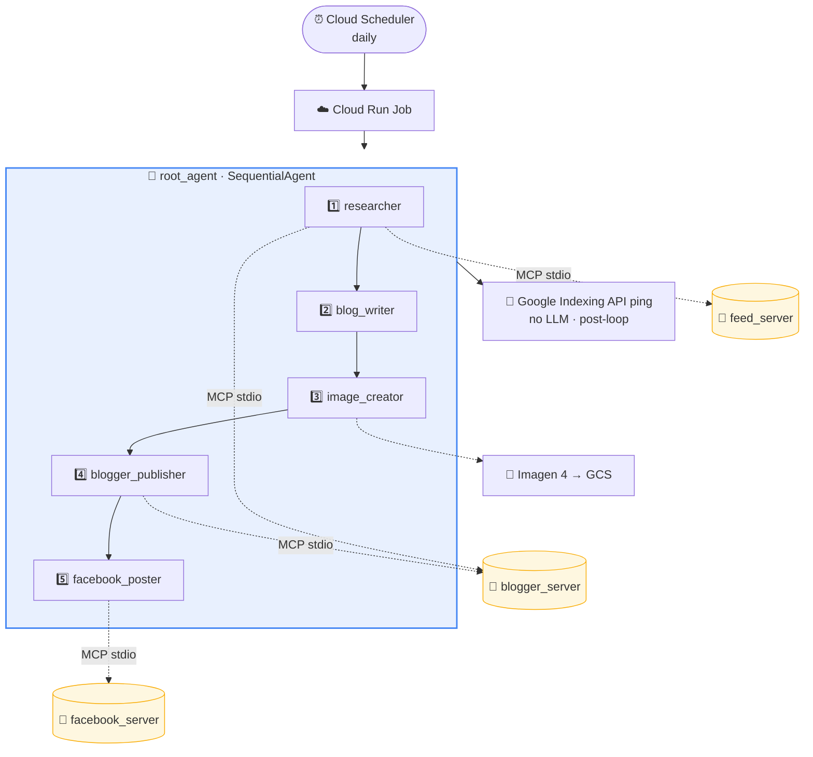
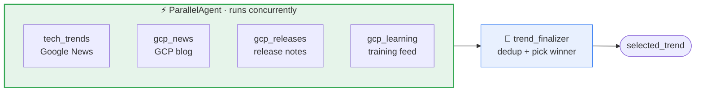
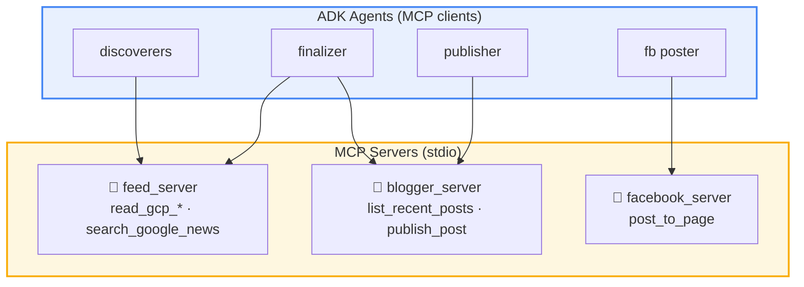
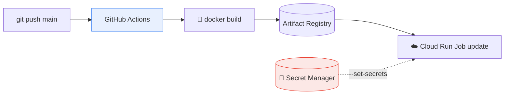

# 🤖 Autonomous Trend-to-Blog Agent Pipeline

> A fully autonomous content engine built on the **[Google Agent Development Kit (ADK)](https://google.github.io/adk-docs/)**. Every day it discovers a timely Google Cloud topic, writes an SEO-optimized article with an AI-generated cover image, publishes it to Blogger, cross-posts to Facebook, and asks Google to index the new URL — **with zero human input.**

<p align="center">
  <a href="https://blog.cloud-edify.com"></a>
  
  
  
  
</p>

---

## ✨ What makes this interesting

This isn't a single prompt wrapped in a cron job. It's a **multi-agent system** that demonstrates several production patterns most demos skip:

- **🧩 Three reusable MCP servers** (feed, Blogger, Facebook) — the agents talk to the outside world exclusively through the [Model Context Protocol](https://modelcontextprotocol.io/), the same way Claude Desktop or any other MCP client would. Decoupled, language-agnostic, and reusable by sibling projects.
- **⚡ Parallel + sequential orchestration** — four discoverers run concurrently, then a finalizer picks one winner. Each writes to a unique state key (the ADK-canonical way to avoid race conditions).
- **🔒 Code-enforced guardrails** — a `before_tool_callback` policy gate physically blocks non-compliant content from ever reaching the live publish API. Safety lives in code, not in a prompt the model can ignore.
- **📐 Schema-validated output** — the writer emits a Pydantic-validated `BlogDraft`; the framework guarantees a well-formed object or fails loudly, eliminating an entire class of parsing bugs.
- **🛡️ No hallucinated URLs** — the model picks a *tool* (`read_gcp_releases`), never types a URL. Endpoint choice stays on the trusted server side.

---

## 🏗️ Architecture



The root agent is a `SequentialAgent`. Each stage reads from and writes to shared **session state** — the output of one stage becomes the input of the next.

| # | Stage | Type | Reads → Writes |
|---|-------|------|----------------|
| 1 | `researcher` | Sequential (Parallel + LLM) | candidate lists → `selected_trend` |
| 2 | `blog_writer` | LLM + `output_schema` | `selected_trend` → `blog_draft` |
| 3 | `image_creator` | LLM + Imagen 4 | `blog_draft` → `cover_image_url` |
| 4 | `blogger_publisher` | LLM + MCP | `blog_draft` + image → `published_url` |
| 5 | `facebook_poster` | LLM + MCP | `published_url` → `facebook_post_url` |

> After the agent loop, `run_agent.py` pings the **Google Indexing API** with `published_url` — pure Python, no LLM, no extra cost.

---

## 🔬 Stage 1 — Parallel research

The researcher is itself a two-stage sub-pipeline: **fan out, then converge.**



Each discoverer writes to its **own** state key — `tech_trends_candidates`, `gcp_news_candidates`, etc. — which is exactly how ADK prevents the classic parallel-agent race condition where branches clobber a shared key. The finalizer then reads all four, deduplicates against recently published posts (via the Blogger MCP server), and prioritizes fresh Google Cloud topics since the blog lives on a GCP domain.

| Discoverer | Source | MCP tool | Signal |
|------------|--------|----------|--------|
| `tech_trends` | Google News | `search_google_news` | news velocity |
| `gcp_news` | Google Cloud blog | `read_gcp_blog` | freshness |
| `gcp_releases` | GCP release notes | `read_gcp_releases` | freshness |
| `gcp_learning` | Training & Certs | `read_gcp_learning` | freshness |

---

## 🧩 The MCP layer

Every external capability is an **MCP server** spawned over stdio. The agents are clients. This is the [Google-canonical `McpToolset` pattern](https://google.github.io/adk-docs/tools/mcp-tools/) — and it means each server is a standalone, reusable microservice.



**A shared helper keeps the wiring DRY.** Each agent gets exactly one tool via `tool_filter`:

```python
# trend_agent/servers/__init__.py
def _stdio_toolset(server_path: str, tool_filter: list[str]) -> McpToolset:
    return McpToolset(
        connection_params=StdioConnectionParams(
            server_params=StdioServerParameters(
                command=sys.executable, args=[server_path]
            ),
            timeout=60,
        ),
        tool_filter=tool_filter,   # LLM sees only this one tool
    )
```

```python
# trend_agent/sub_agents/researcher.py
gcp_releases_discoverer = LlmAgent(
    name="gcp_releases_discoverer",
    model="gemini-2.5-flash-lite",
    instruction=GOOGLE_RELEASES_DISCOVERER_PROMPT,
    tools=[feed_toolset("read_gcp_releases")],   # ← one filtered MCP tool
    output_key="gcp_releases_candidates",
)
```

> **Why no raw URLs?** The model calls `read_gcp_releases()` — a tool, not a URL. The actual feed endpoint lives inside the server, so a model typo can never redirect the fetcher to an arbitrary address.

---

## 📐 Schema-validated writing

The writer uses ADK **structured output**. Gemini is forced to emit JSON matching a Pydantic model; the framework validates it and writes a clean dict to state.

```python
# trend_agent/sub_agents/writer.py
class BlogDraft(BaseModel):
    title: str = Field(description="SEO title, 50-65 chars, keyword near start")
    meta_description: str = Field(description="140-160 chars, includes keyword")
    slug: str = Field(description="lowercase-hyphenated, ASCII, 3-6 words")
    html: str = Field(description="full HTML body, 700-1000 words")
    image_prompt: str = Field(description="one sentence for the cover image")
    labels: list[str] = Field(description="3-5 topic tags")

writer_agent = LlmAgent(
    name="blog_writer",
    model="gemini-2.5-flash",
    instruction=WRITER_PROMPT,
    output_schema=BlogDraft,            # ← framework-enforced JSON
    output_key="blog_draft",
    disallow_transfer_to_parent=True,   # required with output_schema
    disallow_transfer_to_peers=True,    #   in a SequentialAgent
)
```

---

## 🔒 Code-enforced content policy

A `before_tool_callback` inspects every publish **before** it hits the live API. Returning a dict makes ADK skip the real tool call entirely — nothing gets published.

```python
# trend_agent/callbacks.py  (simplified)
def policy_gate(tool, args, tool_context) -> dict | None:
    if tool.name not in {"publish_post", "post_to_page"}:
        return None                       # only gate publish tools
    text = " ".join(str(args.get(k, "")) for k in
                    ("title", "html_content", "meta_description", "message"))
    if _BANNED_RE.search(text):           # finance/hype phrases
        return {"result": "ERROR: blocked by content policy. Not published."}
    return None                           # clean → allow
```

> This is the principle behind it: **put critical business logic in callbacks, not instructions.** A prompt rule can be argued around by the model; a callback cannot.

---

## 📁 Project structure

```
run_agent.py                      # Production entrypoint (headless)
trend_agent/
├── agent.py                      # Root SequentialAgent wiring
├── prompts.py                    # All agent instructions (tune here)
├── callbacks.py                  # policy_gate + retry helper
├── servers/                      # 🧩 MCP servers (reusable microservices)
│   ├── __init__.py               #   shared McpToolset helpers
│   ├── feed_server.py            #   RSS / Google News ingestion
│   ├── blogger_server.py         #   Blogger publish + history
│   └── facebook_server.py        #   Graph API page post
├── sub_agents/
│   ├── researcher.py             #   parallel discovery + finalizer
│   ├── writer.py                 #   schema-validated BlogDraft
│   ├── image_creator.py          #   Imagen 4 cover image
│   ├── blogger_publisher.py      #   + policy_gate
│   └── facebook_poster.py        #   + policy_gate
└── tools/
    ├── imagen_tool.py            #   Imagen 4 → GCS upload
    └── indexing_tool.py          #   Google Indexing API ping
tests/                            # pytest units (offline, no API keys)
.github/workflows/deploy.yml      # CI/CD → Cloud Run Job
```

---

## 🚀 Quickstart

Requires **Python 3.12** and the `gcloud` CLI.

```bash
python -m venv .venv
source .venv/bin/activate              # Windows: .\.venv\Scripts\Activate.ps1
pip install -r requirements.txt
cp .env.example .env                    # then fill in the values
```

### Run it

```bash
adk web .              # 🖥️  interactive UI with per-stage inspection
python run_agent.py    # 🤖  headless — exactly what runs in production
```

### Test it

```bash
python -m pytest tests/ -q
```

Tests cover the deterministic logic — the policy gate and feed parsing — with `feedparser` stubbed, so they run **offline with no credentials.**

---

## 🔑 Credentials

`BLOGGER_REFRESH_TOKEN` must be generated under the account that **owns the blog**, carrying both the `blogger` and `indexing` OAuth scopes:

```bash
pip install google-auth-oauthlib        # local-only, not a runtime dep
python get_refresh_token.py
```

> The Indexing API uses **no IAM roles** — authorization comes from the OAuth account being an **Owner** of the property in Google Search Console.

All secrets are injected at runtime via Cloud Run's `--set-secrets`, sourced from **Secret Manager**. Nothing sensitive lives in the image.

---

## ☁️ Deployment



Pushing to `main` triggers `.github/workflows/deploy.yml`, which builds the image, pushes to Artifact Registry, and updates the `trend-agent-job` Cloud Run Job. A successful run ends like this:

```
✓ Stage complete: https://blog.cloud-edify.com/2026/05/...
✓ Stage complete: https://www.facebook.com/<page_id>/posts/<id>
↳ Requesting Google indexing for: https://blog.cloud-edify.com/2026/05/...
✓ Indexing ping sent — 2026-05-...Z
```

---

## ⚙️ Tech stack

| Layer | Technology |
|-------|------------|
| Orchestration | Google ADK 1.34 (`SequentialAgent`, `ParallelAgent`, `LlmAgent`) |
| Models | Gemini 2.5 Flash · Gemini 2.5 Flash-Lite (discoverers) |
| Tool protocol | Model Context Protocol (MCP) over stdio |
| Image generation | Imagen 4 Fast → Cloud Storage |
| Publishing | Blogger API v3 · Facebook Graph API · Google Indexing API |
| Runtime | Cloud Run Job · Cloud Scheduler |
| Secrets | Secret Manager (injected at deploy) |
| CI/CD | GitHub Actions → Artifact Registry |

---

## ⚠️ Known limitations

- **Blogger search description.** The API's `customMetaData` field does *not* set a post's Search Description, so the meta description is embedded as a `<meta>` tag in the post HTML instead. Confirm *Settings → Meta tags → Enable search description* is ON.
- **Custom permalink.** Blogger may reshape slugs that don't match its `/YYYY/MM/<slug>.html` convention; confirm slugs land as intended.
- **Feeds are "latest," not "trending."** GCP feeds are chronological, so the finalizer ranks by freshness and dedups against recent posts to avoid blogging the same release note twice.

---

<p align="center"><em>Built with Google ADK · MCP · Gemini · Cloud Run</em></p>