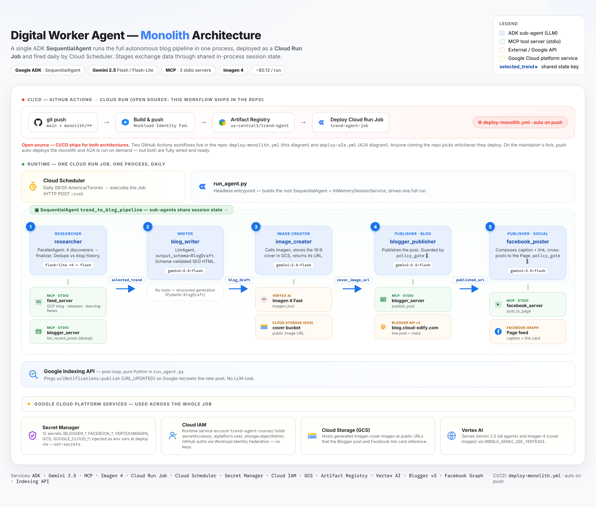
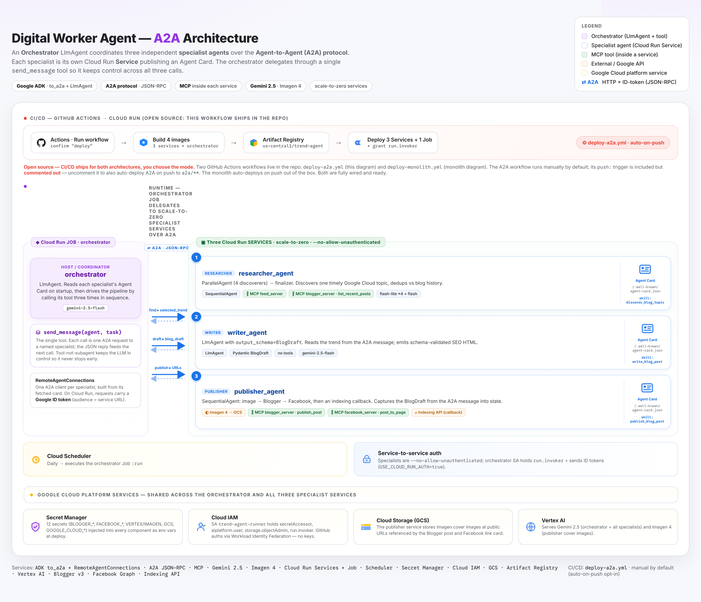

# Digital Worker Agent

> An autonomous AI agent that researches trending technology topics, writes SEO-optimized articles, generates cover images, and publishes content to Blogger and Facebook — all with zero human intervention.

This repository contains **the same pipeline built two ways**, side by side.
Both produce identical results: a post on Blogger, a Facebook cross-post, and
an Indexing API ping. They differ in architecture and deployment model.

```
contentCreator/
├── monolith/   ← One SequentialAgent · Cloud Run Job · auto-deploys on push
└── a2a/        ← Orchestrator + 3 specialist services · default deploy manually or auto-deploys on push
```

Both are open source. Both ship with a complete Cloud Run workflow. You choose
which to deploy.

---

## What it does

Every day, automatically:

1. **Discovers** a timely Google Cloud topic (parallel feed + news scanning)
2. **Writes** a 1 000–2 000 word SEO-optimized blog post (Gemini 2.5 Flash)
3. **Generates** a cover image (Imagen 4 → Cloud Storage)
4. **Publishes** to Blogger
5. **Cross-posts** a caption + link to a Facebook Page
6. **Pings** the Google Indexing API for a fast recrawl

---

## The two architectures

### `monolith/` — one process, one deployable



```
Cloud Scheduler ──► Cloud Run Job
                         │
                    SequentialAgent
                         │
          ┌──────────────┼──────────────────────┐
          ▼              ▼                       ▼
      researcher      writer            image → blogger → facebook
      (parallel       (Gemini +              (policy gate on
       discovery +     output_schema)         publish actions)
       finalizer)          │
                           └──► indexing ping (run_agent.py)
```

Five sub-agents run in sequence in a single Python process. Data flows through
**shared session state** — no network boundaries, no serialization. One Docker
image, one Cloud Run Job, one thing to monitor.

**Stack:** ADK `SequentialAgent` + `ParallelAgent`, MCP (3 stdio servers),
Gemini 2.5 Flash, Imagen 4, Blogger v3, Facebook Graph API, GCS, Indexing API.

### `a2a/` — four services, A2A protocol



```
Cloud Scheduler ──► Cloud Run Job (orchestrator)
                         │  LlmAgent + send_message tool
                         │          
              ┌──────────┼────────────────┐
              ▼          ▼                ▼
   researcher-agent  writer-agent  publisher-agent
   Cloud Run Service  Cloud Run Service  Cloud Run Service
   :8001 (A2A)        :8002 (A2A)        :8003 (A2A)
   parallel discovery  BlogDraft schema   image+blogger+
   + finalizer         output_key         facebook+indexing
```

The same five stages are split into three independent services that talk over
the **Agent-to-Agent (A2A)** protocol.
The orchestrator is an `LlmAgent` whose only tool is
`send_message(agent_name, task)` — it keeps control across all three
delegations, feeds each result into the next call.

**Stack:** ADK `LlmAgent` + `ParallelAgent`, A2A (`to_a2a`, `AgentCard`,
`RemoteAgentConnections`), MCP (same 3 servers), same models and APIs.

---

## Key differences

| | `monolith/` | `a2a/` |
|---|---|---|
| **Shape** | 1 `SequentialAgent`, 5 sub-agents | Orchestrator + 3 specialist services |
| **Data between stages** | Shared session state | JSON over the A2A network boundary |
| **Deployables** | 1 Cloud Run Job | 3 Cloud Run Services + 1 Cloud Run Job |
| **CI/CD trigger** | Auto — every push to `main` touching `monolith/**` | Manual — `workflow_dispatch` from the Actions tab or Auto by following instruction inside deploy-a2a.yml |
| **Service-to-service auth** | N/A (one process) | Google ID token (`USE_CLOUD_RUN_AUTH=true`) |
| **Scale-to-zero** | Job exits when done | Services scale to zero between runs |
| **Idle cost** | ~$0 | ~$0 |
| **Operational complexity** | Low (one thing to watch) | Higher (4 services, agent cards, auth) |
| **Best for** | Fixed daily autonomous job | Reusable agents, dynamic routing, teams |

---

## Shared components

Both architectures use the **exact same** external integrations and tool code:

- **`feed_server.py`** — GCP blog, release notes, training, Google News (MCP)
- **`blogger_server.py`** — `list_recent_posts` (dedup) + `publish_post` (MCP)
- **`facebook_server.py`** — `post_to_page` with sanitize + retry (MCP)
- **`imagen_tool.py`** — Imagen 4 cover image → GCS
- **`indexing_tool.py`** — Google Indexing API ping
- **`BlogDraft`** Pydantic schema — validated writer output
- **`policy_gate`** — safety callback on every publish action
- **12 GCP secrets** — same Secret Manager names, injected into whichever runs

---

## Quick start

Clone and set up the shared virtual environment at the repo root:

```bash
git https://github.com/faridmitri/my_blogger_agent.git
cd contentCreator
python -m venv .venv
source .venv/bin/activate 
```

### Run the monolith locally

```bash
cd monolith
pip install -r requirements.txt
cp .env.example .env               # fill in the 12 values
python run_agent.py                # publishes for real — run when ready
```

### Run the A2A version locally

```bash
cd a2a
pip install -r requirements.txt
cp .env.example .env               # same 12 values; USE_CLOUD_RUN_AUTH=false

# Terminal 1, 2, 3 — one per specialist service:
uvicorn agents.researcher_agent.agent:a2a_app --host 127.0.0.1 --port 8001
uvicorn agents.writer_agent.agent:a2a_app     --host 127.0.0.1 --port 8002
uvicorn agents.publisher_agent.agent:a2a_app  --host 127.0.0.1 --port 8003

# Terminal 4 — orchestrator:
python -m orchestrator.run
```

---

## Deploying to Cloud Run

Both architectures ship with complete CI/CD. See **`PLAYBOOK.md`** for the
one-time GCP setup (APIs, Artifact Registry, secrets, Workload Identity
Federation). Once that's done:

### Method 1 — Deploy the monolith (automatic on push)

`.github/workflows/deploy-monolith.yml` fires automatically on every push to
`main` that touches `monolith/**`. It builds from `monolith/Dockerfile`, pushes
to Artifact Registry, and creates/updates the Cloud Run **Job** `trend-agent-job`
with all 12 secrets injected.

```bash
git add monolith/
git commit -m "your change"
git push origin main               # ← triggers the deploy
```

Schedule the job to run daily (one-time, after first deploy):

```bash
gcloud scheduler jobs create http monolith-daily \
  --location=us-central1 --schedule="0 9 * * *" \
  --time-zone="America/Toronto" \
  --uri="https://us-central1-run.googleapis.com/apis/run.googleapis.com/v1/namespaces/YOUR_PROJECT_ID/jobs/trend-agent-job:run" \
  --http-method=POST \
  --oauth-service-account-email=YOUR_SERVICE_ACCOUNT
```

Changes to `a2a/**` never trigger this workflow.

### Method 2 — Deploy the A2A system (manual from Actions tab)

`.github/workflows/deploy-a2a.yml` is **`workflow_dispatch`-only** — it never
fires on push. To deploy the distributed version:

1. **GitHub → Actions → "Deploy A2A to Cloud Run"**
2. Click **Run workflow**
3. Type `deploy` in the confirmation box

The workflow then:
- Builds all 4 images in parallel
- Deploys 3 Cloud Run **Services** (`--no-allow-unauthenticated`, scale-to-zero)
- Captures each service's HTTPS URL
- Grants the orchestrator's service account `roles/run.invoker` on each service
- Deploys the orchestrator Cloud Run **Job** with `USE_CLOUD_RUN_AUTH=true`
  (ID-token auth wired in `orchestrator/remote_agent_connection.py`)
- Prints the `gcloud scheduler` command to schedule it daily

The summary step at the end of the workflow prints the exact Scheduler command
with your service URLs filled in — copy and run it once.

#### Enable A2A auto-deploy on push (optional)

If you want A2A to also deploy on push (for example, if you're maintaining only
the A2A architecture), open `.github/workflows/deploy-a2a.yml` and uncomment
the `push:` block. The comment block at the top of the file explains exactly
what to change.

> **Note:** if both workflows have a `push:` trigger, both deploy on every
> relevant push. Only enable this intentionally.

---

## CI/CD summary

| Workflow | Trigger | Deploys |
|---|---|---|
| `deploy-monolith.yml` | Auto — push to `main`, paths: `monolith/**` | Cloud Run **Job** `trend-agent-job` |
| `deploy-a2a.yml` | Manual — `workflow_dispatch` + confirm "deploy" | 3 Cloud Run **Services** + 1 **Job** |

---

## How the A2A services authenticate on Cloud Run

The three specialist services deploy `--no-allow-unauthenticated`. The
orchestrator calls them with a **Google ID token** whose audience is each
service's URL. This is handled automatically by `_GoogleIdTokenAuth` in
`orchestrator/remote_agent_connection.py`, activated when
`USE_CLOUD_RUN_AUTH=true` (set by the CI workflow on the orchestrator job).

Locally, `USE_CLOUD_RUN_AUTH` defaults to `false` — plain HTTP, no tokens.

---

## Repo layout

```
contentCreator/
├── README.md                       ← you are here
├── PLAYBOOK.md                     ← step-by-step commands (local + deploy)
├── .github/
│   └── workflows/
│       ├── deploy-monolith.yml     ← auto on push (monolith/**)
│       └── deploy-a2a.yml         ← manual workflow_dispatch or follow instruction to auto on push
│
├── monolith/                       ← THE DEPLOYED SYSTEM
│   ├── trend_agent/                ← ADK agent package
│   ├── run_agent.py                ← entrypoint
│   ├── Dockerfile                  ← python:3.12-slim
│   ├── requirements.txt
│   ├── tests/
│   ├── .env.example
│   └── NOTICE.md
│
└── a2a/                            ← DISTRIBUTED REFERENCE / ALSO DEPLOYABLE
    ├── orchestrator/               ← LlmAgent + send_message tool
    ├── agents/
    │   ├── researcher_agent/       ← parallel discovery + finalizer
    │   ├── writer_agent/           ← BlogDraft schema + SEO writer
    │   └── publisher_agent/        ← image + blogger + facebook + indexing
    ├── common/                     ← shared prompts, servers, tools, callbacks
    ├── tests/                      ← 14 offline tests
    ├── .env.example
    └── NOTICE.md
```

---

## Further reading

- **`PLAYBOOK.md`** — all commands: run locally, one-time GCP setup, deploy each
  architecture, schedule the job, troubleshoot.


## Agents in action

### Monolith


### A2A
